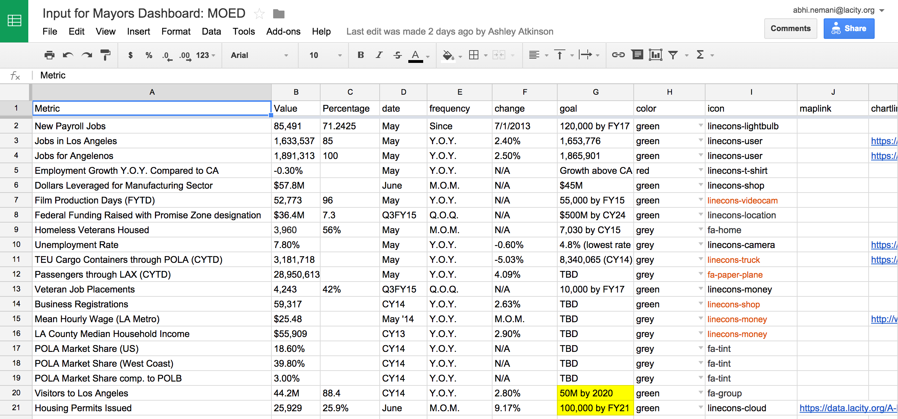

# bradley-tower

This is the live, operational dashboard for the mayor of Los Angeles, which any city is welcome to use and customize. It has been built to be decidely simple to deploy and maintain; it is free and open source, can be hosted freely on GitHub, and is powered by Google Docs (another free solution). 

There are two key functional elements to the dashboard: 

1) **"Metric Cards"**: Simple, quick-to-understand boxes for each key metrics (either overall or for a specific department/issue); these include a goal, a current status, a delta, and an editorial indication of progress (eg red, green). These are entirely built via the Google Sheets integration, and dynamically updated by any changes to those spreadsheets.
2) **Visualizations**: Interactive charts, graphs, an maps that provide deep dives into key policy/issue areas. These are typically manually built using D3 or CartoDB, though some charts are dynamically created by API integrations with Socrata; do note: most if not all are manually updated, in line with the city's performance management unit/process.

## Architecture / How Things Work

The core technology is TableTop.js, Bootstrap, Sheetsee.js, and Jekyll -- all client side software, which won't require a server or must work to get going. 

* Jekyll: Simple, lightweight content management system that makes it easy to create, say, a blog; for bradley tower, it is being used make it easy to add new pages and manage design across the board. Each dashboard is a "post" where the header content for Jekyll informs the system where the data is, etc.
* Tabletop.js / Sheetsee.js: Javascript plugins designed to easily pull data from Google Spreadsheets on the client side and build dynamic pages -- think using Google Sheets as a lightweight database that's easily editable by non-technical staff
* Boostrap: Very popular design framework

## Deploying the Dashboard

There are two versions of the Dashboard: this repository, which relies on Jekyll to manage pages / deployment; and another, lighterweight version that is all static HTML. (See here for documentation on deploying the latter, which is far easier and requires no local software -- eg git, etc.)

### Redeploying the site

The site is hosted on GitHub using Github Pages and Jekyll. This means it comes at no cost and requires no internal hosting. 

### Setting up the Data

All of the data for the "metric cards" comes from a specific Google Sheet for each page on the dashboard:

It's important to keep the formatting/headers from the spreadsheet. You can grab a copy of the spreadsheet here and copy to your own Google Docs account. 

1) Go to the Google Sheets template
2) Make a copy to your own account
3) Select File - Publish to the Web, and copy the SheetID from the provided url (e.g. 1ZVxlgt9couygM7bzteI3YMX8OSE-jnfZAssTb8xUQ2Q)
4) Paste that url in the header section of any dashboard you hope to create with the label (gdoc) (see more below)

Note: the icon column relies on the popular, open, and free icons from Linecons and Font Awesome.

Please reach out to @abhinemani if you're interested in helping out or redeploying it. 
